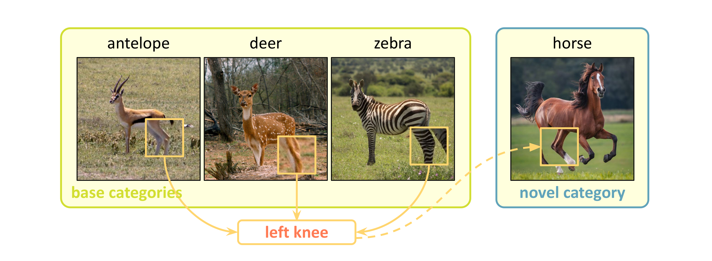

# ESCAPE: Encoding Super-keypoints for Category-Agnostic Pose Estimation
<br/>

This repo contains the official PyTorch implementation for the paper [ESCAPE: Encoding Super-keypoints for Category-Agnostic Pose Estimation](https://openaccess.thecvf.com/content/CVPR2024/papers/Nguyen_ESCAPE_Encoding_Super-keypoints_for_Category-Agnostic_Pose_Estimation_CVPR_2024_paper.pdf)
by [Khoi Duc Nguyen](https://khoiucd.github.io/), [Chen Li](https://chaneyddtt.github.io/), [Gim Hee Lee](https://www.comp.nus.edu.sg/~leegh/)

--------------------

> Abstract: In this paper, we tackle the task of category-agnostic pose estimation (CAPE), which aims to predict poses for objects of any category with few annotated samples. Previous works either rely on local matching between features of support and query samples or require support keypoint identifier. The former is prone to overfitting due to its sensitivity to sparse samples, while the latter is impractical for the open-world nature of the task. To overcome these limitations, we propose ESCAPE - a Bayesian framework that learns a prior over the features of keypoints. The prior can be expressed as a mixture of super-keypoints, each being a high-level abstract keypoint that captures the statistics of semantically related keypoints from different categories. We estimate the super-keypoints from base categories and use them in adaptation to novel categories. The adaptation to an unseen category involves two steps: first, we match each novel keypoint to a related super-keypoint; and second, we transfer the knowledge encoded in the matched super-keypoints to the novel keypoints. For the first step, we propose a learnable matching network to capture the relationship between the novel keypoints and the super-keypoints, resulting in a more reliable matching. ESCAPE mitigates overfitting by directly transferring learned knowledge to novel categories while it does not use keypoint identifiers.



## Dependencies
1. Clone this repository and navigate to the folder
   
     ```bash
     git clone https://github.com/khoiucd/escape-tgt.git
     cd escape-tgt
     ```
2. Install packages
   
     ```Shell
     conda create -n escape python=3.10 -y
     conda activate escape
     pip install -r requirements.txt
     ```
     
     We run this repo with Pytorch 2.2.2 (CUDA 12.1). Please refer to the official documentation [Pytorch](https://pytorch.org/) for installation. Then install mmcv and mmpose.

     - Install mmcv
       ```Shell
       git clone https://github.com/open-mmlab/mmcv.git
       cd mmcv
       git checkout 0092699fef27a0e6cbe9c37f4c4de2fb6996a1c7
       pip install -e .
       cd ..
       ```
     - Install mmpose
       ```Shell
       git clone https://github.com/open-mmlab/mmpose.git
       cd mmpose
       git checkout e07b3c47de687c525acd916859c8d2e49d27d1fd
       pip install -e .
       cd ..
       ```

## Data Preparation
Please refer to the [official guide](https://github.com/luminxu/Pose-for-Everything) to download the MP-100 dataset. Then organize the data structure as follows:
  ```
  data
    |_ mp100
      |_ images
      |  |_ alpaca_face
      |  |_ beaver_body
      |  |_ cheetah_body
      |  |_ human_hand
      |  |_ onager_face
      |  |_ vest
      |  |_ ...
      |_ annotations
         |_ mp100_split1_test.json
         |_ mp100_split1_train.json
         |_ mp100_split1_val.json
         |_ ...
  ```

## Usage

### 1. Simple baseline (see Section 3.2).
The simple baseline includes a feature extractor and a set of keypoint prototypes. They are trained with the MSE loss on the base categories. To train the baseline, run the following command.

```shell
python train.py configs/mp100/baseline/baseline_split${SPLIT}.py
```
The checkpoints will be saved to ```work_dirs/baseline_split${SPLIT}/```.

### 2. Clustering keypoints into super-keypoints (see Section 4 and Appendix A).
After training the simple baseline, cluster the base keypoint prototypes into super-keypoints through ```cluster.py```.

```shell
python cluster.py configs/mp100/baseline/baseline_split${SPLIT}.py \
                <path_to_checkpoint> \
                --threshold 0.8 \
                --extract-features
```
* ```<path_to_checkpoint>``` is the path to the checkpoint.
* ```--threshold``` is the threshold for the KNN clustering (see Appendix A).
* ```--extract-features``` whether to extract keypoint prototypes from base samples or to use the trained keypoint prototypes.

For example, to cluster the trained keypoint prototypes of split 1 with threshold 0.8, run

```shell
python cluster.py configs/mp100/baseline/baseline_split1.py \
                work_dirs/baseline_split1/latest.pth \
                --threshold 0.8
```
The clustering result will be saved to```work_dirs/baseline_split${SPLIT}/superkeypoints.pth```.

### 3. ESCAPE

#### Finetuning feature extractors
We can further finetune the feature extractor with the clustered super-keypoints. Finetuning helps pulling the keypoint features closer to the corresponding super-keypoints, improving the overal performance.

```shell
python train.py configs/mp100/finetune/finetune_split${SPLIT}.py
```
The checkpoints will be saved to ```work_dirs/finetune_split${SPLIT}/```.
#### Training ESCAPE

```shell
python train.py configs/mp100/escape/escape_split${SPLIT}.py \
    --cfg-options model.pretrained=<path_to_checkpoint> \
                  model.keypoint_head.superkeypoints.checkpoint=<path_to_superkeypoints> \
                  model.keypoint_head.superkeypoints.mname=<name_within_state_dict>
```
* ```--cfg-options``` is used to override some settings in the config.
* ```<path_to_checkpoint>``` is the path to the pretrained feature extractor.
* ```<path_to_superkeypoints>``` is the path to the stored super-keypoints.
* ```<name_within_state_dict>``` is the key of super-keypoints within the state_dict.

Example, to train ESCAPE with the finetuned feature extractor and the finetuned super-keypoints, run
```shell
python train.py configs/mp100/escape/escape_split1.py \
    --cfg-options model.pretrained=work_dirs/finetune_split1/latest.pth \
                  model.keypoint_head.superkeypoints.checkpoint=work_dirs/finetune_split1/latest.pth \
                  model.keypoint_head.superkeypoints.mname=keypoint_head.keypoints
```

### 4. Testing
Test a method with the following.

```shell
# 1-shot
python test.py <config> <path_to_checkpoint> \
                --cfg-options data.episodes_per_gpu=1
                
# 5-shot
python test.py <config> <path_to_checkpoint> \
                --cfg-options data.test.num_shots=5 \
                              data.episodes_per_gpu=1
```
* ```<config>``` is the path to the config file, used to specify method (baseline, finetune, or escape).
* ```<path_to_checkpoint>``` is the path to the checkpoint.
* ```data.test.num_shots``` is the number of support samples in each episodes.
* ```data.episodes_per_gpu``` is the number of episodes in each testing batch.

### 5. Results and pretrained checkpoints
The results are slightly different from what were reported in the main paper due to different random seeds. We provides the results and their corresponding checkpoints in the table below. The checkpoints for 1-shot and 5-shot are the same.

|     Method     | Settings | split 1 | split 2 | split 3 | split 4 | split 5 |
|:--------------:|:--------:|:-------:|:-------:|:-------:|:-------:|:-------:|
|    Baseline    |  1-shot  |  [84.35](https://github.com/khoiucd/escape-tgt/releases/download/checkpoints/baseline_split1.pth)  |  [79.94](https://github.com/khoiucd/escape-tgt/releases/download/checkpoints/baseline_split2.pth)  |  [79.91](https://github.com/khoiucd/escape-tgt/releases/download/checkpoints/baseline_split3.pth)  |  [80.23](https://github.com/khoiucd/escape-tgt/releases/download/checkpoints/baseline_split4.pth)  |  [79.33](https://github.com/khoiucd/escape-tgt/releases/download/checkpoints/baseline_split5.pth)  |
|    Baseline    |  5-shot  |  90.37  |  85.85  |  84.87  |  86.69  |  85.53  |
|    Finetune    |  1-shot  |  [84.16](https://github.com/khoiucd/escape-tgt/releases/download/checkpoints/finetune_split1.pth)  |  [81.10](https://github.com/khoiucd/escape-tgt/releases/download/checkpoints/finetune_split2.pth)  |  [80.21](https://github.com/khoiucd/escape-tgt/releases/download/checkpoints/finetune_split3.pth)  |  [80.48](https://github.com/khoiucd/escape-tgt/releases/download/checkpoints/finetune_split4.pth)  |  [79.70](https://github.com/khoiucd/escape-tgt/releases/download/checkpoints/finetune_split5.pth)  |
|    Finetune    |  5-shot  |  90.23  |  86.82  |  84.94  |  87.00  |  85.83  |
|     ESCAPE     |  1-shot  |  [85.98](https://github.com/khoiucd/escape-tgt/releases/download/checkpoints/escape_split1.pth)  |  [82.72](https://github.com/khoiucd/escape-tgt/releases/download/checkpoints/escape_split2.pth)  |  [81.35](https://github.com/khoiucd/escape-tgt/releases/download/checkpoints/escape_split3.pth)  |  [82.00](https://github.com/khoiucd/escape-tgt/releases/download/checkpoints/escape_split4.pth)  |  [80.99](https://github.com/khoiucd/escape-tgt/releases/download/checkpoints/escape_split5.pth)  |
|     ESCAPE     |  5-shot  |  91.19  |  87.57  |  85.46  |  87.69  |  86.42  |


## References
If you find the code useful for your research, please consider citing
```bibtex
@inproceedings{nguyen2024escape,
  title={ESCAPE: Encoding Super-keypoints for Category-Agnostic Pose Estimation},
  author={Nguyen, Khoi Duc and Li, Chen and Lee, Gim Hee},
  booktitle={Proceedings of the IEEE/CVF Conference on Computer Vision and Pattern Recognition},
  pages={23491--23500},
  year={2024}
}
```

## Acknowledgment
We thank the following repos providing helpful components/functions in our work.
- [Pose-for-Everything](https://github.com/luminxu/Pose-for-Everything.git)
- [CapeFormer](https://github.com/flyinglynx/CapeFormer.git)
- [mmpose](https://github.com/open-mmlab/mmpose.git)
- [vit-pytorch](https://github.com/lucidrains/vit-pytorch.git)
- [SuperGluePretrainedNetwork](https://github.com/magicleap/SuperGluePretrainedNetwork.git)
